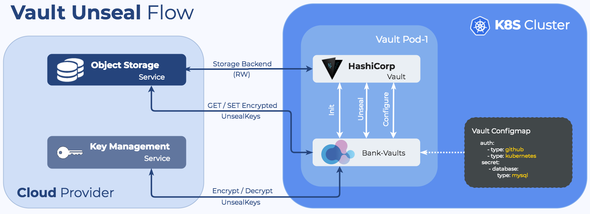

Vault starts in an uninitialized state, which means it has to be initialized with an initial set of parameters. The response to the init request is the *root token* and *unseal keys*. After that, Vault becomes initialized, but remains in a *sealed* state.

Bank-Vaults stores the root token and the unseal keys in one of the following:

- AWS KMS keyring (backed by S3)
- Azure Key Vault
- Google Cloud KMS keyring (backed by GCS)
- Alibaba Cloud KMS (backed by OSS)

For development and testing purposes, the following solutions are also supported. Do not use these in production environments.

- Kubernetes Secrets (should be used only for development purposes)
- Dev Mode (useful for `vault server -dev` dev mode Vault servers)
- Files (backed by files, should be used only for development purposes)

## Keys stored by Bank-Vaults

Bank-Vaults stores the following keys:

- `vault-root`, which is Vault's root token.
- `vault-unseal-N` unseal keys, where `N` is a number, starting at 0 up to the maximum defined minus 1. For example, 5 unseal keys will be `vault-unseal-0 ... vault-unseal-4`.

HashiCorp [recommends revoking the root tokens](https://developer.hashicorp.com/vault/docs/concepts/tokens#root-tokens) after the initial set up of Vault has been completed.

> Note: The `vault-root` token is not needed to unseal Vault, and can be removed from the storage if it was put there via the `--init` call to `bank-vaults`.

If you want to decrypt the root token for some reason, see {}.

## Unseal Vault

> Unsealing is the process of constructing the master key necessary to read the decryption key to decrypt data, allowing access to Vault. ([From the official Vault documentation](https://developer.hashicorp.com/vault/docs/concepts/seal))

After initialization, Vault remains in a *sealed state*. In sealed state no secrets can reach or leave Vault until a person, possibly more people than one, unseals it with the required number of unseal keys.

Vault data and the unseal keys live together: if you delete a Vault instance installed by the operator, or if you delete the Helm chart, all your data and the unseal keys to that initialized state should remain untouched. For details, see the [official documentation](https://developer.hashicorp.com/vault/docs/concepts/seal).



## The Bank-Vaults Init and Unseal process

Bank-Vaults runs in an endless loop and does the following:

1. Bank-Vaults checks if Vault is initialized. If yes, it continues to step 2, otherwise Bank-Vaults:
    1. Calls Vault init, which returns the root token and the configured number of unseal keys.
    1. Encrypts the received token and keys with the configured KMS key.
    1. Stores the encrypted token and keys in the cloud provider's object storage.
    1. Flushes the root token and keys from its memory with explicit garbage control as soon as possible.
1. Bank-Vaults checks if Vault is sealed. If it isn't, it continues to step 3, otherwise Bank-Vaults:
    1. Reads the encrypted unseal keys from the cloud provider's object storage.
    1. Decrypts the unseal keys with the configured KMS key.
    1. Unseals Vault with the decrypted unseal keys.
    1. Flushes the keys from its memory with explicit garbage control as soon as possible.
1. If the [external configuration file]() was changed and an OS signal is received, then Bank-Vaults:
    1. Parses the configuration file.
    1. Reads the encrypted root token from the cloud provider's object storage.
    1. Decrypts the root token with the configured KMS key.
    1. Applies the parsed configuration on the Vault API.
    1. Flushes the root token from its memory with explicit garbage control as soon as possible.
1. Repeats from the second step after the configured time period.
