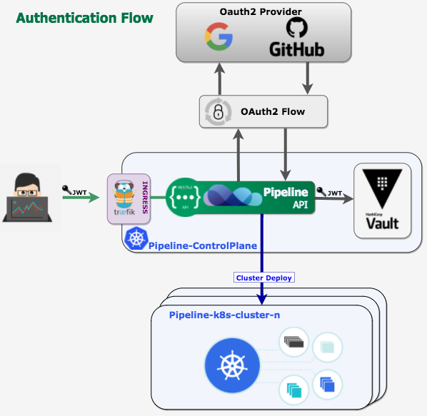
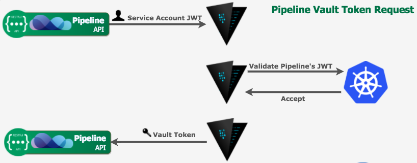

The [Bank-Vaults repository](https://github.com/bank-vaults/bank-vaults/) contains several Go packages for interacting with Vault, these packages are organized into the `sdk` Go module, which can be pulled in with `go get github.com/banzaicloud/bank-vaults/pkg/sdk` and is versioned by the `pkg/sdk/vX.Y.Z` Git tags:

- [pkg/sdk/auth](https://github.com/bank-vaults/bank-vaults/tree/master/pkg/sdk/auth)

    Stores JWT bearer tokens in Vault.

    (*NOTE: The Gin handler has been moved out to [gin-utilz](https://github.com/banzaicloud/gin-utilz/tree/master/auth)* )

    

- [pkg/sdk/vault](https://github.com/bank-vaults/bank-vaults/tree/master/pkg/sdk/vault)

    A wrapper for the official Vault client with automatic token renewal, and Kubernetes support.

    

- [pkg/sdk/db](https://github.com/bank-vaults/bank-vaults/tree/master/pkg/sdk/db)

    A helper for creating database source strings (MySQL/PostgreSQL) with database credentials dynamically based on configured Vault roles (instead of `username:password`).

    

- [pkg/sdk/tls](https://github.com/bank-vaults/bank-vaults/tree/master/pkg/sdk/tls)

    A simple package to generate self-signed TLS certificates. Useful for bootstrapping situations, when you can't use Vault's [PKI secret engine](https://www.vaultproject.io/docs/secrets/pki/index.html).

## Examples for using the library part

Some examples are in `cmd/examples/main.go`

- [Vault client example](https://github.com/bank-vaults/bank-vaults/blob/master/cmd/examples/main.go#L17)
- [Dynamic secrets for MySQL example with Gorm](https://github.com/bank-vaults/bank-vaults/blob/master/cmd/examples/main.go#L45)
- [JWTAuth tokens example with a Gin middleware](https://github.com/bank-vaults/bank-vaults/blob/master/cmd/examples/main.go#L53)
