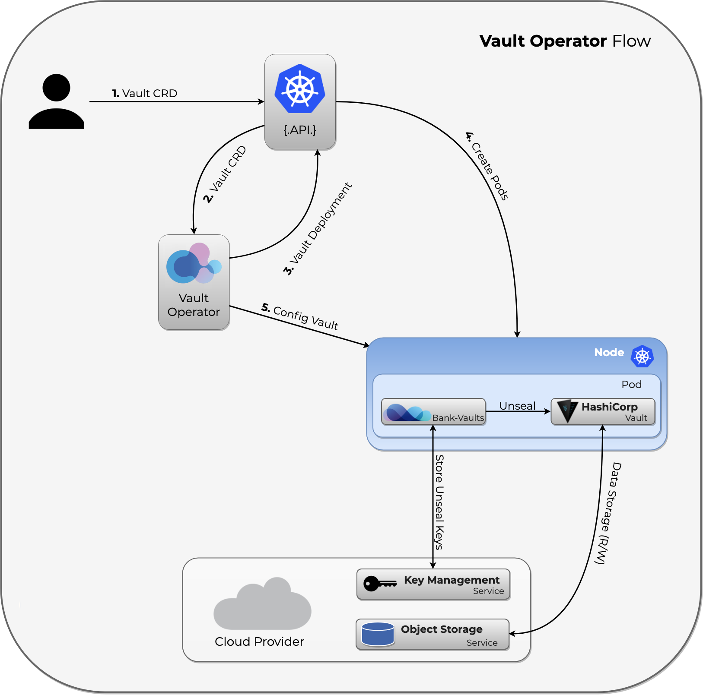

The Vault operator builds on Bank-Vaults features such as:

- external, API based configuration (secret engines, auth methods, policies) to automatically re/configure a Vault cluster
- automatic unsealing (AWS, GCE, Azure, Alibaba, Kubernetes Secrets (for dev purposes), Oracle)
- TLS support

The operator flow is the following:



The source code can be found in the [vault-operator](https://github.com/bank-vaults/vault-operator) repository.

The operator requires the following [cloud permissions]().



## HA setup with Raft

In a production environment you want to run Vault as a cluster. The following CR creates a 3-node Vault instance that uses the Raft storage backend:

1. Install the Bank-Vaults operator:

    ```bash
    helm repo add banzaicloud-stable https://kubernetes-charts.banzaicloud.com
    helm upgrade --install vault-operator oci://ghcr.io/bank-vaults/helm-charts/vault-operator
    ```

1. Create a Vault instance using the `cr-raft.yaml` custom resource. This will create a Kubernetes `CustomResource` called `vault` that uses the Raft backend:

    ```bash
    kubectl apply -f https://raw.githubusercontent.com/banzaicloud/bank-vaults/master/operator/deploy/rbac.yaml
    kubectl apply -f https://raw.githubusercontent.com/banzaicloud/bank-vaults/master/operator/deploy/cr-raft.yaml
    ```


Make sure to set up a solution for backing up the storage backend to prevent data loss. Bank-Vaults doesn't do this automatically. We recommend using [Velero]() for backups.


## Pod anti-affinity

If you want to setup pod anti-affinity, you can set `podAntiAffinity` vault with a topologyKey value.
For example, you can use `failure-domain.beta.kubernetes.io/zone` to force K8S deploy vault on multi AZ.

## Delete a resource created by the operator

If you manually delete a resource that the Bank-Vaults operator has created (for example, the Ingress resource), the operator automatically recreates it every 30 seconds. If it doesn't, then something went wrong, or the operator is not running. In this case, check the logs of the operator.
