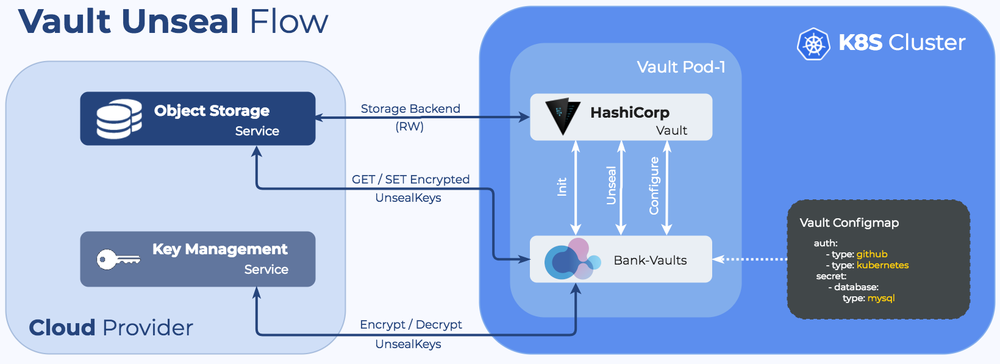

> Unsealing is the process of constructing the master key necessary to read the decryption key to decrypt data, allowing access to Vault. ([From the official Vault documentation](https://www.vaultproject.io/docs/concepts/seal.html))

Vault starts in an uninitialized state, which means it has to be initialized with an initial set of parameters. The response to the init request is the *root token* and *unseal keys*. After that, Vault becomes initialized, but remains in a *sealed state*. A sealed state is a state in which no secrets can reach or leave Vault until a person, possibly more people than one, unseals it with the required number of unseal keys.

Vault data and the unseal keys live together: if you delete a Vault instance installed by the operator, or if you delete the Helm chart, all your data and the unseal keys to that initialized state should remain untouched. Read more about it in the [official documentation](https://www.vaultproject.io/docs/concepts/seal/).

## The Bank-Vaults Init and Unseal process

[Bank-Vaults](https://github.com/bank-vaults/bank-vaults) runs in an endless loop and does the following:



1. [Bank-Vaults](https://github.com/bank-vaults/bank-vaults) checks if Vault is initialized. If yes, it continues to step 2, otherwise Bank-Vaults:
    1. Calls Vault init, which returns the root token and the configured number of unseal keys.
    1. Encrypts the received token and keys with the configured KMS key.
    1. Stores the encrypted token and keys in the cloud provider's object storage.
    1. Flushes the root token and keys from its memory with explicit GC as soon as possible.
1. [Bank-Vaults](https://github.com/bank-vaults/bank-vaults) checks if Vault is sealed. If it isn't, it continues to step 3, otherwise Bank-Vaults:
    1. Reads the encrypted unseal keys from the cloud provider's object storage.
    1. Decrypts the unseal keys with the configured KMS key.
    1. Unseals Vault with the decrypted unseal keys.
    1. Flushes the keys from its memory with explicit GC as soon as possible.
1. If the [external configuration file]() was changed and an OS signal is received, then Bank-Vaults:
    1. Parses the configuration file.
    1. Reads the encrypted root token from the cloud provider's object storage.
    1. Decrypts the root token with the configured KMS key.
    1. Applies the parsed configuration on the Vault API
    1. Flushes the root token from its memory with explicit GC as soon as possible.
1. Repeats from the second step after the configured time period.

## Keys stored by Bank-Vaults

Bank-Vaults stores the following keys:

- `vault-root`, which is the Vault's root token
- `vault-unseal-N`, where `N` is a number, starting at 0 up to the maximum defined minus 1, e.g. 5 unseal keys will be `vault-unseal-0` up to including `vault-unseal-4`

HashiCorp [recommends to revoke root tokens](https://www.vaultproject.io/docs/concepts/tokens.html#root-tokens) after the initial set up of Vault has been completed.
To unseal Vault, the `vault-root` token is not needed and can be removed from the storage if it was put there via the `--init` call to `bank-vaults`.

## Decrypting root token

### AWS

To use the KMS-encrypted root token with Vault CLI:

Required CLI tools:

- aws

Steps:

1. Download and decrypt the root token (and the unseal keys, but that is not mandatory) into a file on your local file system:

    ```bash
    BUCKET=bank-vaults-0
    REGION=eu-central-1

    for key in "vault-root" "vault-unseal-0" "vault-unseal-1" "vault-unseal-2" "vault-unseal-3" "vault-unseal-4"
    do
        aws s3 cp s3://${BUCKET}/${key} .

        aws kms decrypt \
            --region ${REGION} \
            --ciphertext-blob fileb://${key} \
            --encryption-context Tool=bank-vaults \
            --output text \
            --query Plaintext | base64 -d > ${key}.txt

        rm ${key}
    done
    ```

1. Save it as an environment variable:

    ```bash
    export VAULT_TOKEN="$(cat vault-root.txt)"
    ```

### Google Cloud

To use the KMS-encrypted root token with vault CLI:

Required CLI tools:

- `gcloud`
- `gsutil`

```bash
GOOGLE_PROJECT="my-project"
GOOGLE_REGION="us-central1"
BUCKET="bank-vaults-bucket"
KEYRING="beta"
KEY="beta"

export VAULT_TOKEN=$(gsutil cat gs://${BUCKET}/vault-root | gcloud kms decrypt \
                     --project ${GOOGLE_PROJECT} \
                     --location ${GOOGLE_REGION} \
                     --keyring ${KEYRING} \
                     --key ${KEY} \
                     --ciphertext-file - \
                     --plaintext-file -)
```

### Kubernetes

There is a Kubernetes Secret backed unseal storage in Bank-Vaults, you should be aware of that Kubernetes Secrets are base64 encoded only if you are not using a [EncryptionConfiguration](https://kubernetes.io/docs/tasks/administer-cluster/encrypt-data/) in your Kubernetes cluster.

```bash
VAULT_NAME="vault"

export VAULT_TOKEN=$(kubectl get secrets ${VAULT_NAME}-unseal-keys -o jsonpath={.data.vault-root} | base64 -d)
```

## Migrate unseal keys between cloud providers

If you need to move your Vault instance from one provider or an external managed Vault, you have to store those the unseal keys and a root token in the Bank-Vaults format.

All examples assume that you have created files holding the root-token and the 5 unseal keys in plaintext:

- vault-root.txt
- vault-unseal-0.txt
- vault-unseal-1.txt
- vault-unseal-2.txt
- vault-unseal-3.txt
- vault-unseal-4.txt

For migrating the Vault storage data you will have to use [official migration command](https://www.vaultproject.io/docs/commands/operator/migrate/) provided by Vault.

### AWS

Moving the above mentioned files to an AWS bucket and encrypt them with KMS before:

```bash
REGION=eu-central-1
KMS_KEY_ID=02a2ba49-42ce-487f-b006-34c64f4b760e
BUCKET=bank-vaults-1

for key in "vault-root" "vault-unseal-0" "vault-unseal-1" "vault-unseal-2" "vault-unseal-3" "vault-unseal-4"
do
    aws kms encrypt \
        --region ${REGION} --key-id ${KMS_KEY_ID} \
        --plaintext fileb://${key}.txt \
        --encryption-context Tool=bank-vaults \
        --output text \
        --query CiphertextBlob | base64 -d > ${key}

    aws s3 cp ./${key} s3://${BUCKET}/

    rm ${key} ${key}.txt
done
```
